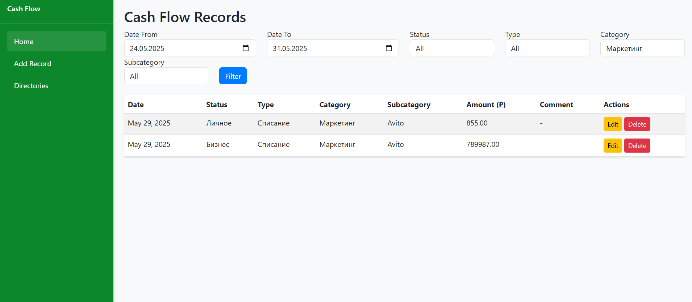
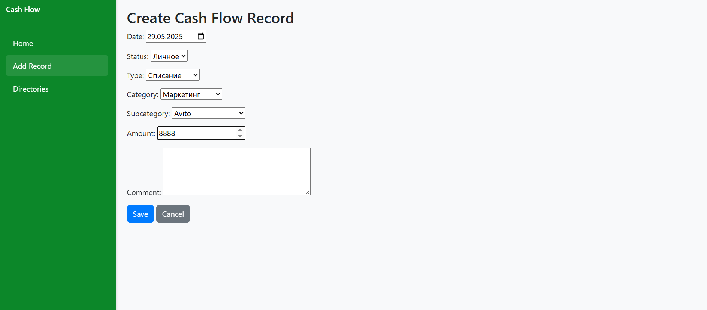

# Cash Flow Management

A Django-based web application for managing cash flow records, including statuses, types, categories, and subcategories. The application allows users to add, edit, and delete financial records, filter them, and manage directory entries with dependencies, styled with Bootstrap and inspired by Material Dashboard.

## Features
- **Cash Flow Records**: Create, edit, delete, and filter financial transactions by date, status, type, category, and subcategory.
- **Directory Management**: Add, edit, and delete statuses (e.g., Business, Personal, Tax), types (e.g., Income, Expense), categories (e.g., Infrastructure, Marketing), and subcategories (e.g., VPS, Avito) with proper dependencies.
- **Responsive Design**: Vertical sidebar navigation, full-height layout, and mobile-friendly interface using Bootstrap.
- **Default Data**: Pre-populated statuses, types, categories, and subcategories via data migration.

## Prerequisites
- Python 3.8+
- Git
- SQLite 

## Installation and Setup

### 1. Clone the Repository
```bash
git clone https://github.com/aizhankk/Cash-flow.git
cd Cash-flow
```

### 2. Set Up a Virtual Environment
```bash
python -m venv venv
source venv/bin/activate  # On Windows: venv\Scripts\activate
```

### 3. Install Dependencies
Install the required Python packages listed in `requirements.txt`:
```bash
pip install -r requirements.txt
```


### 4. Set Up the Database
The project uses SQLite by default, so no external database setup is required. Apply migrations to create the database and populate default data:
```bash
python manage.py makemigrations
python manage.py migrate
```

This will:
- Create tables for `Status`, `Type`, `Category`, `SubCategory`, and `CashFlow` models.
- Populate default data:
  - **Statuses**: Business, Personal, Tax
  - **Types**: Income, Expense
  - **Categories**: Infrastructure (subcategories: VPS, Proxy), Marketing (subcategories: Farpost, Avito)

### 5. (Optional) Create a Superuser
To access the Django admin panel:
```bash
python manage.py createsuperuser
```
Follow the prompts to set up a username, email, and password.

### 6. Collect Static Files
Collect static files (CSS, JS) for production-like serving:
```bash
python manage.py collectstatic
```

### 7. Run the Web Service
Start the Django development server:
```bash
python manage.py runserver
```
Access the application at `http://127.0.0.1:8000/`.

## Usage
- **Home Page (`/`)**: View and filter cash flow records.
- **Add Record (`/create/`)**: Create new cash flow entries with dynamic category/subcategory selection.
- **Directory Management (`/directory/`)**: Add, edit, or delete statuses, types, categories, and subcategories.
- **Admin Panel (`/admin/`)**: Manage all data with the Django admin interface (requires superuser login).

## Project Structure
```
cashflow/
├── finance/                # Main Django app
│   ├── migrations/         # Database migrations, including initial data
│   ├── static/            # CSS and JS files
│   ├── templates/         # HTML templates
│   ├── models.py          # Database models
│   ├── views.py           # Application logic
│   ├── forms.py           # Form definitions
│   └── urls.py            # URL routing
├── cashflow/              # Project settings
├── manage.py              # Django management script
└── requirements.txt       # Python dependencies
```

## Screenshots
Below are screenshots of the application’s interface:

### Home Page

*Displays filtered cash flow records with a vertical sidebar.*

### Directory Management

*Manage statuses, types, categories, and subcategories.*


## License
This project is licensed under the MIT License. See the [LICENSE](LICENSE) file for details.